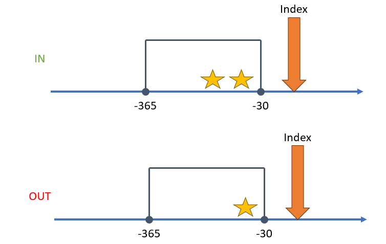
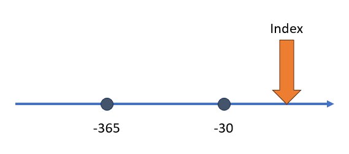
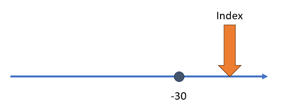
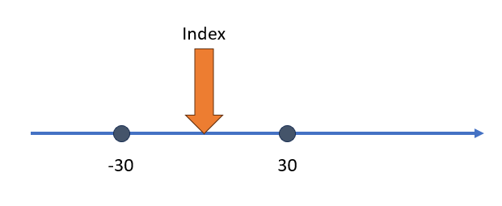

```{r, include = FALSE}
knitr::opts_chunk$set(
  collapse = TRUE,
  comment = "#>"
)
```

```{r setup, echo=FALSE}
library(Capr)
```


# Intro

`Capr` allows users to build OHDSI cohort definitions in R outside of ATLAS. `Capr`, like ATLAS, uses the same underlying software `circe-be` to compose the cohort logic into an actionable query. Therefore we must understand sub-components of the cohort definition, in order to properly apply them to our cohort construction. There are three main sub-components that drive building of the cohort logic: 1) query, 2) criteria and 3) group. In this vignette, we will describe the purpose of each sub-component and demonstrate the `Capr` commands to invoke these structures. 

# Query 

## Definition

The *query* is a `circe-be` construct that defines which concepts to extract from which domain table in the OMOP CDM. In basic terms it is finding the persons that have a particular code in the data. Through a more technical lens, the query is supplying the **WHERE** and **FROM** logic in portions of the SQL script. Ultimately the logic we construct in `Capr` or ATLAS render a standardized SQL script that finds persons in the database, of which the query is vital in providing the code sets to search from. The *query* will be found all over the cohort definition. Whenever we need to apply a concept set, it will be through a *query*. In `Capr` the *query* function is specified based on the domain tables available in the CDM. The table below provides the mapping between the OMOP domain and the the `Capr` function call. 

```{r queryTable, echo=FALSE}
tb <- tibble::tribble(
  ~`OMOP Domain`, ~`Capr Function`,
  "DrugExposure", "drugExposure",
  "DrugEra", "drugEra",
  "ConditionOccurrence", "conditionOccurrence",
  "ConditionEra", "conditionEra",
  "ProcedureOccurrence", "procedure",
  "Measurement", "measurement",
  "VisitOccurrence", "visit",
  "Observation", "observation",
  "Death", "death"
)
knitr::kable(tb)
```

## Example

A simple example of how to use a query in `Capr` can be seen below:

```{r queryEx, eval=FALSE}
t1dConceptSet <- cs(descendants(195771), name = "T1D")
t1dQuery <- conditionOccurrence(t1dConceptSet)
```


With our query we can apply this in a variety of places within the cohort definition. Below we give an example of a cohort of persons starting on metformin as our index event, where they could not have been diagnosed with Type 1 Diabetes any time prior. 

```{r queryInCohort, eval=FALSE}
metforminConceptSet <- cs(descendants(1503297), name = "metformin")
t1dConceptSet <- cs(descendants(195771), name = "T1D")

metforminCohort <- cohort(
  entry = entry(
    # metformin drug query as index event
    drugExposure(metforminConceptSet, firstOccurrence()), 
    observationWindow = continuousObservation(priorDays = -365, postDays = 365L),
    primaryCriteriaLimit = "All"
  ),
  attrition = attrition(
    'noT1d' = withAll(
      exactly(
        x = 0, 
        # query for t1d occurrence to exclude patients
        query = conditionOccurrence(t1dConceptSet), 
        aperture = duringInterval(
          startWindow = eventStarts(a = -Inf, b = 0, index = "startDate")
        )
      )
    )
  ),
  exit = exit(
    endStrategy = observationExit(),
    censor = censoringEvents(
      #exit based on observence of t1d condition
      # query for t1d occurrence for censor
      conditionOccurrence(t1dConceptSet) 
    )
  )
)
```

Notice that the *query* is applied all over this cohort definition. The metformin query sets the concept set to use as the index event. The Type 1 Diabetes (T1D) query sets the attrition of the patients identified at index who should be excluded for having the condition. The T1D query also sets the exit from cohort. The cohort ends when the person has no more observation time in the database or they have been diagnosed with T1D. Remember the *query* is infusing the concept sets into the cohort logic based on which domain to search for codes in person healthcare records. 

## Attributes

The *query* is often contextualized by an attribute. For example in the cohort above, we are searching for metformin in the drug exposure table given it has occurred for the first time in the person history. The attribute is a object that modifies queries by filtering records based on the presence of another parameter. Attributes can be based on person information (such as gender, race, or age), time based (observation at a certain time window), domain based (presence of a code in a different column of the same domain), or event based (based on the observation of another event occurring). We will go into more details on different attributes in a different vignette. In `Capr` as many attributes can be attached within the query after providing the concept set. Example below:

```{r attrInQuery, eval=FALSE}
t1dConceptSet <- cs(descendants(195771), name = "T1D")

maleT1D <- conditionOccurrence(t1dConceptSet, male())
maleT1D18andOlder <- conditionOccurrence(t1dConceptSet, male(), age(gte(18)))
maleT1D18andOlderFirstDx <- conditionOccurrence(
  t1dConceptSet, male(), age(gte(18)), firstOccurrence())
```

One special type of attribute is a nested query. This construct is more complex and requires understanding of the *criteria* and *group* objects. We will return to this idea later in this vignette. 

# Criteria

## Definition

A *criteria* object is one that enumerates the presence or absence of an event within a window of observation relative to an index point. The index point may be the entry event of the cohort definition. It could also be a prior event if we are building a nested query. The purpose of this object is to count whether a person has experienced certain events that would either include or exclude them from the cohort. Its easiest to show a *criteria* using a figure. Say relative from index we want to see two exposures of a drug within 365 days and 30 days before index. Those that fit that criteria remain in the cohort, those that do not are excluded from the cohort. See the figure below as an example:



When building a *criteria* object the user needs: 1) a query, 2) an operator that specifies the number of times a query is observed (occurrences), and 3) a time window which we call the aperture. Using the figure as an example, think of the stars as the query, the number of stars as the occurrences, and the box as the aperture. We could orient this idea around the index event in a variety of different ways. 


## Example

With this definition in mind, let us build an example of a *criteria* object that reflects the image above. 

```{r criteriaExampleA, eval=FALSE}
atenololConceptSet <- cs(descendants(1314002), name = "atenolol")

atenololCriteria <- atLeast(
  x = 2, 
  query = drugExposure(atenololConceptSet),
  aperture = duringInterval(
    startWindow = eventStarts(a = -365, b = -30, index = "startDate")
  )
)
```

This *criteria* specifies that we must observe at least 2 drug exposures of atenolol within 365 days and 30 days before the index start date. By itself, a *criteria* makes little sense. It must sit within the context of the entire cohort definition, where an index event has been specified. In `Capr` the *criteria* object is called in three ways: `atLeast`, `atMost` and `exactly`. The *criteria* object in `Capr` is contextualized by the number of occurrences of the query for its function call. If we wanted to have exactly 2 drug exposures of atenolol or at most 2 drug exposures they can be done as shown below. 

```{r criteriaExampleB, eval=FALSE}
atenololConceptSet <- cs(descendants(1314002), name = "atenolol")

atenololCriteriaA <- exactly(
  x = 2, 
  query = drugExposure(atenololConceptSet),
  aperture = duringInterval(
    startWindow = eventStarts(a = -365, b = -30, index = "startDate")
  )
)

atenololCriteriaB <- atMost(
  x = 2, 
  query = drugExposure(atenololConceptSet),
  aperture = duringInterval(
    startWindow = eventStarts(a = -365, b = -30, index = "startDate")
  )
)

```

## Aperture

An important part of the *criteria* object is providing the temporal context to enumerating the occurrences of the query. In `Capr` we term this interval relative to index as the aperture. It is the opening in the patient timeline at which we are enumerating the event of interest. An aperture can view when an event starts and when the event ends. For both event start and event end, we define a window for which the event is observed. Below we illustrate a few examples of building an aperture and then show the corresponding the `Capr` code.


In this first example we are observing when an event starts between time of 365 to 30 days before the index start date. To build this aperture we use the following `Capr` code:

```{r aperture1, eval=FALSE}
aperture1 <- duringInterval(
  startWindow = eventStarts(a = -365, b = -30, index = "startDate")
)
```

Notice that we define the anchor for our index, either the index start date or the index end date. More times than not this will be the index start date. 


This next example is similar to the first, however now we have an unbounded event window. In this case the event start must be between any time before and 30 days before the index start date. In `Capr` we can always create an unbounded event window by using the `Inf` operator in our code, as shown below.

```{r aperture2, eval=FALSE}
aperture2 <- duringInterval(
  startWindow = eventStarts(a = -Inf, b = -30, index = "startDate")
)
```


Our next example provides an instance where we want our event window to utilize future time. Normally we want to observe an event prior to index. On occasion we can allow for an event to take place after index. The `Capr` code to build this aperture is shown below:

```{r aperture3, eval=FALSE}
aperture3 <- duringInterval(
  startWindow = eventStarts(a = -30, b = 30, index = "startDate")
)
```


Our final example shows a scenario when we want the aperture to be constrained by both a start window and end window. The end window is considering observation of the end of the event. Say for example the event era starts with an exposure to a drug and end is when the person stops taking the drug. If the interest is the full time the person was encountering this medical event we need to create both a start and end window in the aperture. The `Capr` code below would replicate the concept from the figure.

```{r aperture4, eval=FALSE}
aperture4 <- duringInterval(
  startWindow = eventStarts(a = -365, b = -30, index = "startDate"),
  endWindow = eventEnds(a = 30, b = 365, index = "startDate")
)
```

An aperture has two more potential toggles: a) restrict event to the same visit and b) allow events outside the observation period. By default these options are toggled as `FALSE`, so they do not need to be defined in the `Capr` code unless made `TRUE`. These are more advanced options in cohort building. To use the we add this to aperture example 4 to show a full set of options for an aperture in `Capr`:

```{r aperture5, eval=FALSE}
aperture5 <- duringInterval(
  startWindow = eventStarts(a = -365, b = -30, index = "startDate"),
  endWindow = eventEnds(a = 30, b = 365, index = "startDate"),
  restrictVisit = TRUE,
  ignoreObservationPeriod = TRUE
)
```

# Group

## Definition

A *group* object is one that binds multiple criteria and sub-groups as a single expression. This is a very powerful construction because it allows us to build all sorts of complexity in our cohort definition. A *group* must have an operator informing how many *criteria* must be `TRUE` in order for the person to enter the cohort. In `Capr` the options available to build a group are: `withAll`, `withAny`, `withAtLeast` and `withAtMost`. The functions are meant to be intuitive in terms of logic building. `withAll` indicates all the criteria must be `TRUE` for the person to remain in the cohort. `withAny` indicates any one of the *criteria* needs to be `TRUE`. The functions `withAtLeast` and `withAtMost` require an integer to determine how many *criteria* must be `TRUE`. 

## Example

To show the idea of a *group* let us consider a very complicated cohort, like the [PheKB T2D case algorithm](https://www.phekb.org/phenotype/type-2-diabetes-mellitus). To consider a person to be a case of T2D, any one of 5 pathways needs to be `TRUE`. 

```{r t2dAlgo, eval=FALSE}
t2dAlgo <- withAny(
  # Path 1: 0 T2Dx + 1 T2Rx + 1 abLab
  withAll(
    exactly(0, 
            t2d, 
            duringInterval(startWindow = eventStarts(-Inf, 0))
    ),
    atLeast(1, 
            t2dDrug, 
            duringInterval(startWindow = eventStarts(-Inf, 0))
    ),
    withAny(
      atLeast(1, 
              abLabHb, 
              duringInterval(startWindow = eventStarts(-Inf, 0))
      ),
      atLeast(1, 
              abLabRan, 
              duringInterval(startWindow = eventStarts(-Inf, 0))
      ),
      atLeast(1, 
              abLabFast, 
              duringInterval(startWindow = eventStarts(-Inf, 0))
      )
    )
  ),
  #Path 2: 1 T2Dx + 0 T1Rx + 0 T2Rx + 1 AbLab
  withAll(
    atLeast(1, 
            t2d, 
            duringInterval(startWindow = eventStarts(-Inf, 0))
    ),
    exactly(0, 
            t1dDrug, 
            duringInterval(startWindow = eventStarts(-Inf, 0))
    ),
    exactly(0, 
            t2dDrug, 
            duringInterval(startWindow = eventStarts(-Inf, 0))
    ),
    withAny(
      atLeast(1, 
              abLabHb, 
              duringInterval(startWindow = eventStarts(-Inf, 0))
      ),
      atLeast(1, 
              abLabRan, 
              duringInterval(startWindow = eventStarts(-Inf, 0))
      ),
      atLeast(1, 
              abLabFast, 
              duringInterval(startWindow = eventStarts(-Inf, 0))
      )
    )
  ),
  #Path 3: 1 T2Dx + 0 T1Rx + 1 T2Rx
  withAll(
    atLeast(1, 
            t2d, 
            duringInterval(startWindow = eventStarts(-Inf, 0))
    ),
    exactly(0, 
            t1dDrug, 
            duringInterval(startWindow = eventStarts(-Inf, 0))
    ),
    atLeast(1, 
            t2dDrug, 
            duringInterval(startWindow = eventStarts(-Inf, 0))
    )
  ),
  #Path 4: 1 T2Dx + 1 T1Rx + 1 T1Rx|T2Rx
  withAll(
    atLeast(1, 
            t2d, 
            duringInterval(startWindow = eventStarts(-Inf, 0))
    ),
    atLeast(1, 
            t1dDrug, 
            duringInterval(startWindow = eventStarts(-Inf, 0))
    ),
    atLeast(1, 
            t1dDrugWT2Drug, 
            duringInterval(startWindow = eventStarts(-Inf, 0))
    )
  ),
  #Path 5: 1 T2Dx  + 1 T1Rx + 0 T2Rx + 2 T2Dx
  withAll(
    atLeast(1, 
            t2d, 
            duringInterval(startWindow = eventStarts(-Inf, 0))
    ),
    atLeast(1, 
            t1dDrug, 
            duringInterval(startWindow = eventStarts(-Inf, 0))
    ),
    exactly(0, 
            t2dDrug, 
            duringInterval(startWindow = eventStarts(-Inf, 0))
    ),
    atLeast(2, 
            t2d, 
            duringInterval(startWindow = eventStarts(-Inf, 0))
    )
  )
)
```

Each pathway is complex and require multiple criteria to determine a T2D case. The *group* allows us to bundle multiple ideas together to build one complex expression. 

## Notes

Now that we have introduced the *criteria* and *group*, there are a few important comments on how these objects are used within `circe-be`. 

**1) Criteria must be placed within a group**   

A *criteria* can not be used on its own, it must be wrapped in a *group*. Even if only one *criteria* is needed, still wrap it in a *group*. An example would be:

```{r criteriaInGroup, eval=FALSE}
noT1d <- withAll(
  # criteria: no t1d prior
  exactly(
    x = 0, 
    query = conditionOccurrence(t1dConceptSet), 
    aperture = duringInterval(
      startWindow = eventStarts(a = -Inf, b = 0, index = "startDate")
    )
  )
)
# wrap this in a group withAll
```

Further to this point, a single attrition rule is a *group*. The example of `noT1d` above would be a single rule in the cohort attrition. This is how we would apply it:

```{r cohortAttrition, eval=FALSE}
cohort <- cohort(
  entry = entry(
    # index event....
  ),
  attrition = attrition(
    'noT1d' = withAll(
      exactly(
        x = 0, 
        # query for t1d occurrence to exclude patients
        query = conditionOccurrence(t1dConceptSet), 
        aperture = duringInterval(
          startWindow = eventStarts(a = -Inf, b = 0, index = "startDate")
        )
      )
    )
  ),
  exit = exit(
    #cohort exit....
  )
)
```


**2) Groups may contain groups**   

A group may contain more groups as part of the same object. We saw this in the PheKB T2D example where one path required an abnormal lab. In the definition there are 3 types of abnormal labs: random glucose, fasting glucose and HbA1c. Any one of these three could be abnormal as part of path 1 of the case algorithm. To build this we need a group within a group.

```{r groupInGroup, eval=FALSE}
# Path 1: 0 T2Dx + 1 T2Rx + 1 abLab
path1 <- withAll(
  exactly(0, 
          t2d, 
          duringInterval(startWindow = eventStarts(-Inf, 0))
  ),
  atLeast(1, 
          t2dDrug, 
          duringInterval(startWindow = eventStarts(-Inf, 0))
  ),
  withAny(
    atLeast(1, 
            abLabHb, 
            duringInterval(startWindow = eventStarts(-Inf, 0))
    ),
    atLeast(1, 
            abLabRan, 
            duringInterval(startWindow = eventStarts(-Inf, 0))
    ),
    atLeast(1, 
            abLabFast, 
            duringInterval(startWindow = eventStarts(-Inf, 0))
    )
  )
)
```

**3) Nested criteria are groups**

Previously we mentioned a special kind of attribute called a nested criteria (also known via ATLAS as a correlated criteria). The idea of a nested criteria is that the index event is based on a particular concept set expression as opposed to the entry event of the cohort definition. For example, we want to build a cohort based on a hospitalization due to heart failure. In this case a person is counted in the cohort if they have first an inpatient visit given that a heart failure (HF) diagnosis has occurred around the time of the inpatient visit. In `Capr` a nested attribute uses the same syntax as a *group* with a prefix of `nested-`, as shown in the example below. The enumeration of the *criteria* is now indexed based on the inpatient visit rather than the entry event of the cohort definition. 

```{r hospHf, eval=FALSE}
ipCse <- cs(descendants(9201, 9203, 262), name = "visit")
hf <- cs(descendants(316139), name = "heart failure")

query <- visit(
  ipCse, #index
  #nested attribute
  nestedWithAll(
    atLeast(1,
            conditionOccurrence(hf),
            duringInterval(
              startWindow = eventStarts(0, Inf, index = "startDate"),
              endWindow = eventStarts(-Inf, 0, index = "endDate")
            )
    )
  )
)
```

# Concluding Remarks

For more information on sub-components of a cohort definition via `circe-be`, users should watch the [videos](https://www.youtube.com/@chrisknoll2007) created by Chris Knoll outlining these ideas. while these videos utilize ATLAS, `Capr` follows the same principles. 
